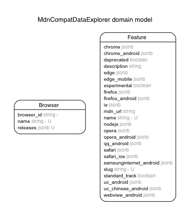

# MDN Browser Compatibility Data Explorer

This is a Rails app that lets the user explore the browser compatibility data that MDN is collecting in [the `browser-compat-data` repo](https://github.com/mdn/browser-compat-data).

## Development
### Running the application locally

You'll need:

- Postgres 11
- Ruby 2.6.x
- Node.js 10.x
- Yarn
- Graphviz

Run the following commands:

1. `gem install bundler`
1. `bundle install`
1. `yarn install`
1. `bundle exec rails db:create`
1. `bundle exec rails db:migrate`
1. `bundle exec rails s`

With that, the site should be up at `localhost:3000`.

### Updating the `mdn-browser-compat-data` package

You can update the `mdn-browser-compat-data` package using `bundle exec rake update:update_mdn_package`. This Rake task will walk you through the steps of updating the package. Alternatively, you can update it manually, described below.

You can update the `mdn-browser-compat-data` package manually by doing the following:

1. Edit the `mdn-browser-compat-data` package version in `package.json` and run `yarn install`.
1. Update the `config.mdn_bcd_version` variable in `config/application.rb` to the current version.
1. Run `node lib/build.js` to regenerate the `public/data.json` file.
1. Commit these changes and open a pull request.

### Updating the database

You can update the database (where all the data is stored) by running
`bundle exec rake db:seed`. Note that this will delete the database and fill it with
whatever data is in `public/data.json` based on `db/seeds.rb`.

The application essentially uses a static data set. It uses a database
simply because I wanted to learn more about databases and wanted an easier
means of querying the data.

#### Updating the database with test data

You can use data from `public/data-test.json` by running 
`USE_TEST_DATA=true bundle exec rake db:seed`. This is useful for ensuring
accuracy, since you can manipulate the JSON and will know, e.g. how many
features should be listed as true.

### CI and Docker

This project uses GitLab CI.

To regenerate and push the Docker container up to the GitLab Container Registry:

- Log into the GitLab CI Docker registry with `docker login registry.gitlab.com` (you'll need to use a Personal Access Token as your password).
- Build the container with `docker build -f Dockerfile -t registry.gitlab.com/connorshea/mdn-compat-data-explorer .`
- Then use `docker push registry.gitlab.com/connorshea/mdn-compat-data-explorer` to push the container to the GitLab Container Registry.

### Deployment

The live site currently uses Heroku, and is available at [mdn-compat-data-explorer.herokuapp.com](https://mdn-compat-data-explorer.herokuapp.com/).

Deployment involves the following:

- Deploy the current version of the `master` branch.
- Run `bundle exec rake db:migrate` and `bundle exec rake db:seed` from the [Heroku Web Console](https://devcenter.heroku.com/articles/heroku-dashboard#web-console) or with the Heroku CLI.

This should update the site to the current codebase and recreate the database from the `db/seeds.rb` file.

### Dependencies

This project uses:

- [Ruby on Rails 5.2](http://rubyonrails.org/)
- [Bootstrap 4.1](http://getbootstrap.com/)
- [Mozilla Developer Network Browser Compatibility Data](https://github.com/mdn/browser-compat-data)
- [Octicons](https://octicons.github.com/)

To view all dependencies used in this project, see the [`Gemfile`](/Gemfile) and [`package.json`](package.json).

### Architecture

## Notes

### Resources

- [Using PostgreSQL and jsonb with Ruby on Rails](https://nandovieira.com/using-postgresql-and-jsonb-with-ruby-on-rails) is a really useful article for understanding jsonb usage with Postgres and Rails (this is used in this app). 
